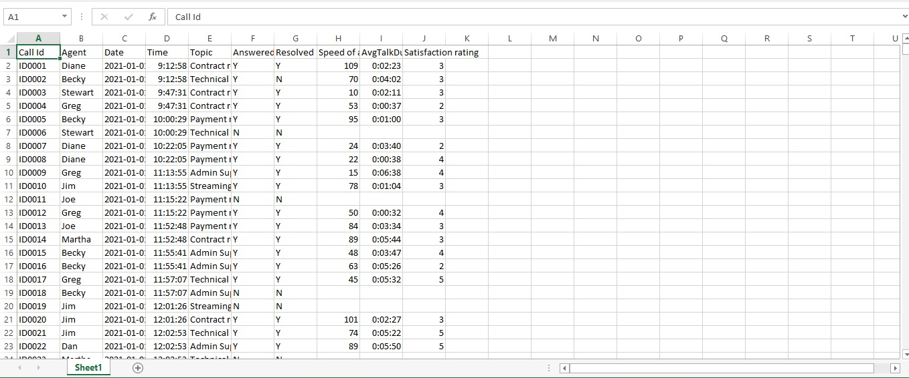
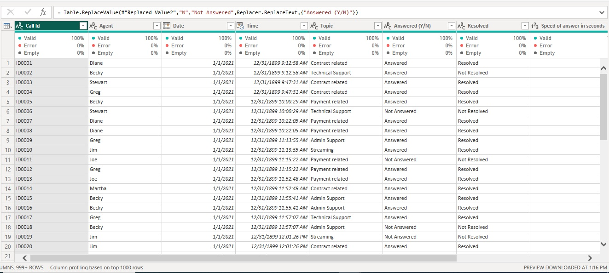
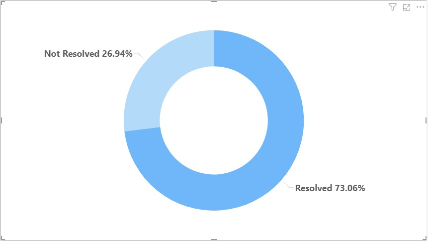
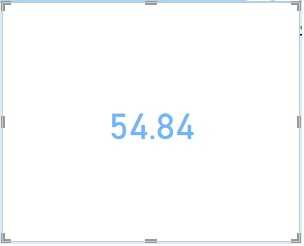
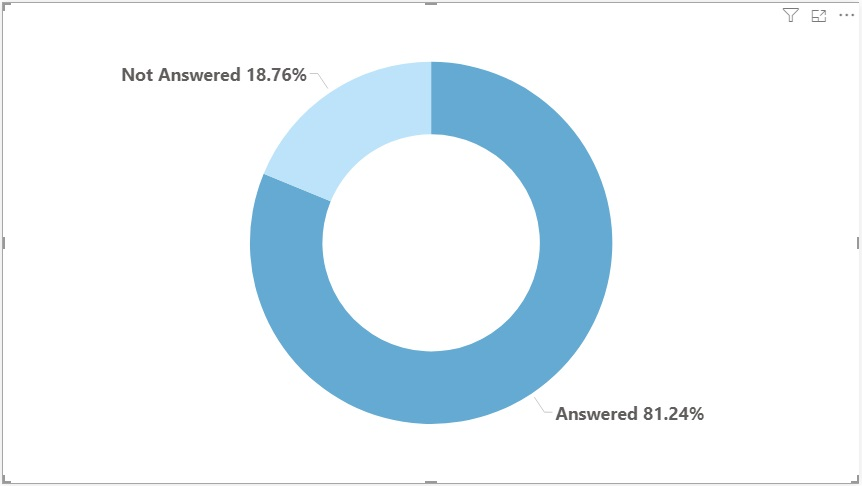
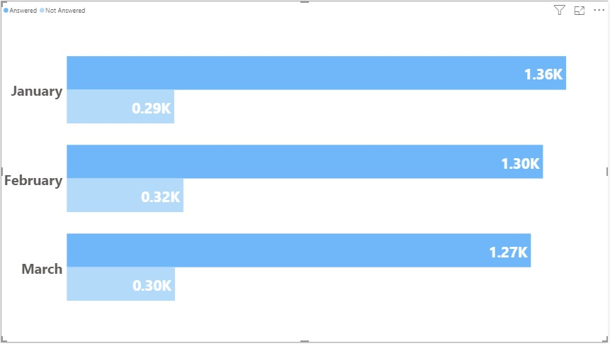
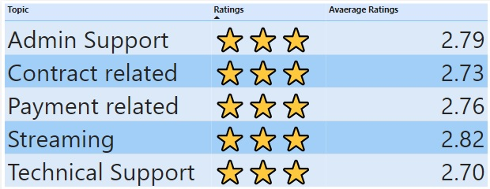
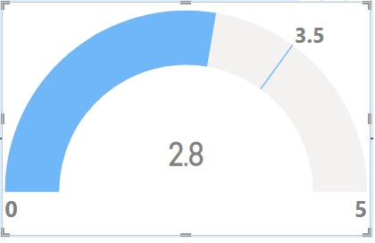
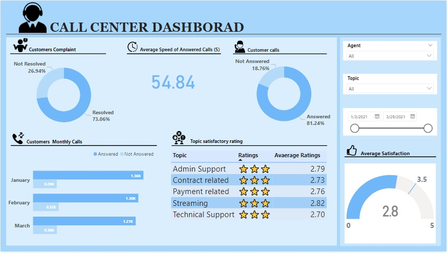

# Call-Center-Performance-Analysis-Using-Power-Bi
The analysis aims to provide valuable insights into the critical Key Performance Indicators (KPIs) and metrics associated with the Call Center Performance. 

## Introduction

The analysis performed on the Call Center dataset was thorough and extensive, encompassing a broad spectrum of vital elements concerning calls and customer satisfaction. The primary objective of this analysis is to offer an insight into the essential Key Performance Indicators (KPIs) and metrics pertaining to the Call Center. Its purpose is to aid managers in monitoring and enhancing their customer support initiatives. Throughout the analysis, a meticulous examination was conducted on numerous variables, covering various facets of the call center's operations.

## Data Set
In this analysis, the dataset employed is comprised of a single data file in Microsoft Excel Worksheet (.xlsx) format. Each row within this dataset represents unique customer details, while the columns encompass diverse attributes related to the call center. The structure of these datasets is designed with columns that house a multitude of information pertaining to each individual customer record. Below is the sscreenshot of the dataset 

## Data Preprocessing/Cleaning
The dataset underwent a transformation process within Power Query Editor to ensure data integrity. Several checks and adjustments were made:
Duplicate Entries: A thorough examination for duplicate entries was conducted to maintain dataset integrity. No duplicates were identified.
Data Type Corrections: Incorrect data types for certain columns were adjusted to align them with their intended purpose.
Blank Cells: A few blank cells were identified and filled with zero to enhance the accuracy of the findings.
Categorical Data Enhancement: To improve precision, categorical data was enhanced: 
"Y" in the "Answered Y/N" column was replaced with "Answered," while "N" was replaced with "Not Answered."
Similarly, "Y" in the "Resolved" column was substituted with "Resolved," and "N" was replaced with "Not Resolved."
These steps were taken to optimize the dataset for further analysis and to ensure that the data accurately reflects the intended information.
Below is a screenshot of the transformed dataset 

## The Key Performance Indicators (KPIs)
The essential Key Performance Indicators (KPIs) and metrics pertaining to the Call Center used for this analysis are
1.	Customer compliant
2.	Average speed of answered calls
3.	Numbers of customer calls 
4.	Customers monthly call.
5.	Topics satisfactory rating 
6.	Average satisfaction. 

### Customer Complaints. 
A doughnut chart was employed to illustrate the distribution of complaints among various customers, showcasing the proportion of resolved and unresolved complaints by customers. This was achieved by including the "resolved" column in both the legend and value sections of the visualization, utilizing the count function to tally both resolved and unresolved cases.  
Below is a screenshot of the resulting visualization:
 

- Insight 

This analysis indicates that a substantial portion of cases, 72.92%, have been successfully "Resolved." This suggests an efficient and effective resolution process within the organization. However, the presence of 27.08% cases marked as "Not Resolved" highlights the need for improvement in handling specific customer issues.

### Average Speed of Answered Calls
To compute the average speed, I initiated the process by selecting the "Card" option within the "Build Visual" section of the visualization menu. Next, I dragged the "Speed of Answering" column into the "Fields" section. Then, I accessed the dropdown menu adjacent to the "Fields" section and chose the "Average" option from the available selections.
Below is a screenshot of the resulting visualization:

### Numbers of Customer calls 
A doughnut chart was utilized to depict the distribution of calls across different customers, highlighting the ratio of answered and unanswered calls. This was accomplished by incorporating the "Answered(Y/N)" column in both the legend and value sections of the visualization, and employing the count function to calculate the totals for both answered and unanswered calls.
Below is a screenshot of the resulting visualization:

- Insight
  
The chart shows that the majority, 81.08% calls, were answered, indicating efficient call handling. However, 18.92% calls were not answered, suggesting the need to improve response rates for enhanced customer satisfaction and service quality.

### Customers’ Monthly Calls 
To determine the monthly call volume, I utilized a clustered bar chart. Firstly, I positioned the date column on the y-axis and applied a hierarchy to select "month" for a monthly breakdown of calls. Then, I placed the "call id" column on the x-axis and used the count function to quantify the call IDs. Finally, I added the "answered (Y/N)" column to the legend section of the visualization for additional context.
Below is a screenshot illustrating the resulting visualization.

- Insight
  
The data reveals that different topics received similar average ratings, all hovering around 2.7 to 2.8. The star ratings assigned to Technical Support, Streaming, Payment related, Contract related, and Admin Support are consistently three stars (⭐⭐⭐), suggesting a moderate level of satisfaction across these categories. Further analysis may be needed to understand why these ratings are not higher and identify areas for potential improvement in customer satisfaction.

### Topic Satisfactory Ratings 
I initiated the procedure by generating a new table that contained data from the Topic and Satisfactory Rating columns. Subsequently, I applied the group-by function to compute the average rating within each category, forming the new table. To create star ratings for each category, I employed a DAX function: Ratings = REPT("⭐", 'Sheet1 (2)'[Average Ratings ]).
Below is a screenshot of the resulting visualization:

- Insight
  
The data reveals that different topics received similar average ratings, all hovering around 2.7 to 2.8. The star ratings assigned to Technical Support, Streaming, Payment related, Contract related, and Admin Support are consistently three stars (⭐⭐⭐), suggesting a moderate level of satisfaction across these categories. Further analysis may be needed to understand why these ratings are not higher and identify areas for potential improvement in customer satisfaction.

### Average Satisfaction. 
To calculate the average customer satisfaction, I began by selecting the "Gauge" option in the "Build Visual" section of the visualization menu. Then, I placed the "satisfaction" column in the "Value" section. Lastly, I chose the "Average" option from the dropdown menu next to the "Value" section. You can see the resulting visualization in the screenshot below: 

## Tool Used 
This analysis was conducted utilizing Power BI.

## Dashboard 
This dashboard is created to visually depict and present all pertinent Key Performance Indicators (KPIs) and metrics within the dataset

## Recommendations
Reviewing recurrent cases in this analysis, support teams should trained for complex issues. Streamlining processes for quicker resolution, collecting feedback from unresolved cases, and maintaining quality checks are essential. Additionally, prioritize response time reduction, critical call handling, and support team training. Implement a feedback system to address unanswered calls and enhance satisfaction, with a focus on improving "Admin Support" and "Contract related" areas.

## Conclusion 
The key performance indicators (KPIs) analyzed in this analysis provide valuable insights into the customer service operations. Customer complaints reveal areas of concern that require attention, while the average speed of answered calls measures the responsiveness. The total number of customer calls and monthly call trends helps to understand call volume fluctuations. Topics satisfactory ratings highlight areas of strength and improvement, while the average satisfaction score reflects overall customer contentment. By continuously monitoring and optimizing these KPIs, the customer service enhanced, drive efficiency, and maintain high levels of satisfaction, ultimately contributing to the success of the organization.
